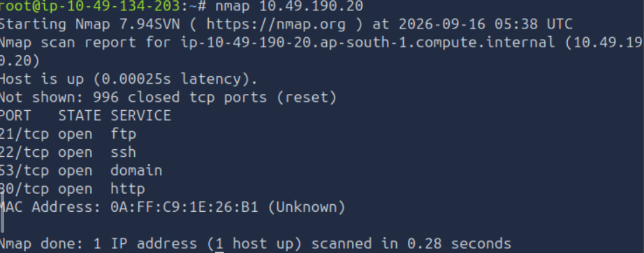
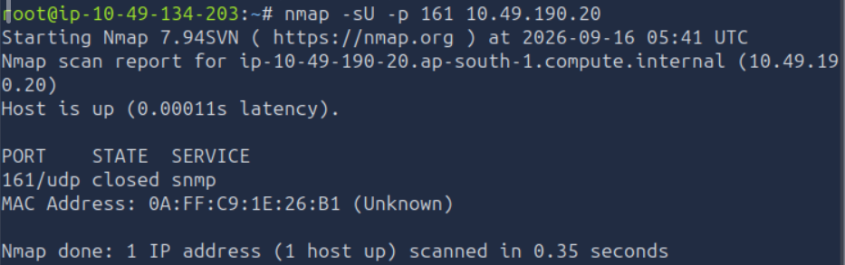

# Nmap - Further Nmap

## Overview

I completed the TryHackMe **Further Nmap** room to learn practical Nmap scanning and enumeration.

**Platform:** TryHackMe  
**Room:** Further Nmap  
**Focus:** Nmap scanning, port states, scan types, NSE scripts, and practical enumeration

---

## What I Learned

During this room, I learned:

- TCP Connect scans
- TCP SYN scans
- UDP scans
- NULL scans
- FIN scans
- Xmas scans
- Ping sweeps
- Port states
- Nmap timing options
- Nmap verbosity
- Nmap Scripting Engine (NSE)
- NSE script categories
- Searching for installed NSE scripts
- Vulnerability scripts
- FTP anonymous enumeration
- SMB enumeration
- Host discovery
- Firewall considerations
- Adding random data to packets using `--data-length`

---

## Basic Nmap Scan

I performed a basic Nmap scan against an authorized TryHackMe lab target.

```bash
nmap 10.49.190.20
```

### Results

| Port | State | Service |
|---|---|---|
| 21/tcp | Open | FTP |
| 22/tcp | Open | SSH |
| 53/tcp | Open | DNS |
| 80/tcp | Open | HTTP |

Nmap also reported 996 closed TCP ports in the default scan.

### Screenshot



---

## TCP Connect Scan

A TCP Connect scan can be performed using:

```bash
nmap -sT <TARGET-IP>
```

It completes the TCP three-way handshake:

```text
SYN
 ↓
SYN/ACK
 ↓
ACK
```

A TCP Connect scan completes the TCP connection.

---

## TCP SYN Scan

A SYN scan can be performed using:

```bash
nmap -sS <TARGET-IP>
```

A SYN scan is also known as a **half-open scan** or **stealth scan**.

The connection is not fully completed.

---

## UDP Scan

UDP scanning can be performed using:

```bash
nmap -sU <TARGET-IP>
```

### My Lab Scan

```bash
nmap -sU -p 161 10.49.190.20
```

### Result

```text
161/udp  closed  snmp
```

Port 161 is commonly associated with SNMP.

### Screenshot



---

## NULL, FIN and Xmas Scans

### NULL Scan

```bash
nmap -sN <TARGET-IP>
```

A NULL scan sends a TCP packet without any flags.

### FIN Scan

```bash
nmap -sF <TARGET-IP>
```

A FIN scan sends a packet with the FIN flag.

### Xmas Scan

```bash
nmap -sX <TARGET-IP>
```

An Xmas scan uses the:

- FIN
- PSH
- URG

TCP flags.

NULL, FIN and Xmas scans can be useful for testing how a target or firewall responds to unusual TCP packets.

---

## Ping Sweep

A ping sweep is used to discover live hosts in a network.

For a `172.16.x.x` network with subnet mask `255.255.0.0`, the CIDR notation is `/16`.

```bash
nmap -sn 172.16.0.0/16
```

The `-sn` option performs host discovery without a port scan.

---

## Nmap Verbosity

Nmap supports different verbosity levels.

```bash
nmap -v <TARGET-IP>
```

A higher verbosity level provides additional information during a scan.

For example:

```bash
nmap -vv <TARGET-IP>
```

---

## Scanning All TCP Ports

To scan all 65,535 TCP ports:

```bash
nmap -p- <TARGET-IP>
```

The `-p-` option represents ports 1-65535.

---

## Nmap Timing Templates

Nmap provides timing templates from `-T0` to `-T5`.

| Option | Timing |
|---|---|
| `-T0` | Paranoid |
| `-T1` | Sneaky |
| `-T2` | Polite |
| `-T3` | Normal |
| `-T4` | Aggressive |
| `-T5` | Insane |

---

## Saving Nmap Output

### Normal format

```bash
nmap -oN scan.txt <TARGET-IP>
```

### XML format

```bash
nmap -oX scan.xml <TARGET-IP>
```

### Grepable format

```bash
nmap -oG scan.txt <TARGET-IP>
```

### All major formats

```bash
nmap -oA scan <TARGET-IP>
```

---

## Nmap Scripting Engine (NSE)

Nmap includes the **Nmap Scripting Engine (NSE)** for additional enumeration and security checks.

### Run a specific script

```bash
nmap --script <script-name> <TARGET-IP>
```

Example:

```bash
nmap --script http-title <TARGET-IP>
```

### Vulnerability Scripts

All scripts in the `vuln` category can be run using:

```bash
nmap --script vuln <TARGET-IP>
```

The `intrusive` category should be used carefully because some scripts may affect or disrupt the target.

---

## Finding NSE Scripts

Nmap stores NSE scripts on Linux in:

```text
/usr/share/nmap/scripts/
```

Scripts can be searched using:

```bash
grep "ftp" /usr/share/nmap/scripts/script.db
```

Another method is:

```bash
ls -l /usr/share/nmap/scripts/*ftp*
```

SMB scripts can be searched using:

```bash
ls -l /usr/share/nmap/scripts/*smb*
```

---

## SMB OS Discovery

The SMB script I identified was:

```text
smb-os-discovery.nse
```

This script is used to gather operating system and related information from an SMB server.

---

## FTP Anonymous Login

The `ftp-anon` NSE script checks whether an FTP server allows anonymous access.

```bash
nmap -p 21 --script ftp-anon <TARGET-IP>
```

The script can also use the optional argument:

```text
ftp-anon.maxlist
```

This controls the maximum number of files or directories that the script attempts to list.

In the practical task, Nmap was able to successfully log in to the FTP server using anonymous access.

---

## Host Discovery and -Pn

Sometimes a host may not respond to normal host-discovery probes.

Nmap can skip host discovery using:

```bash
nmap -Pn <TARGET-IP>
```

This tells Nmap to treat the target as online and continue with the scan.

---

## Adding Random Data to Packets

The Nmap option:

```bash
--data-length <number>
```

can be used to append random data to packets.

Example:

```bash
nmap --data-length 50 <TARGET-IP>
```

---

## Practical Scan Summary

Some important commands from my practice were:

```bash
# Basic scan
nmap <TARGET-IP>

# TCP Connect scan
nmap -sT <TARGET-IP>

# SYN scan
nmap -sS <TARGET-IP>

# UDP scan
nmap -sU <TARGET-IP>

# Xmas scan
nmap -sX <TARGET-IP>

# Ping sweep
nmap -sn 172.16.0.0/16

# Scan all TCP ports
nmap -p- <TARGET-IP>

# Run vulnerability NSE scripts
nmap --script vuln <TARGET-IP>

# FTP anonymous enumeration
nmap -p 21 --script ftp-anon <TARGET-IP>
```

---

## Key Learnings

This room helped me understand that Nmap is more than a basic port scanner.

I learned how to:

- Identify open, closed and filtered ports.
- Understand TCP connection behavior.
- Perform TCP Connect and SYN scans.
- Perform UDP scans.
- Understand NULL, FIN and Xmas scans.
- Perform network host discovery.
- Use Nmap verbosity and timing options.
- Scan all TCP ports.
- Save scan results in different formats.
- Use NSE scripts for additional enumeration.
- Search for installed NSE scripts.
- Use vulnerability-related scripts.
- Enumerate FTP anonymous access.
- Understand how firewalls can affect Nmap results.
- Interpret Nmap output instead of simply running commands.

---

## TryHackMe Completion

I completed the **Further Nmap** TryHackMe room.

**Completed Tasks:** 15  
**Points Earned:** 328

### Screenshot


---

## Tools Used

- Nmap
- Nmap Scripting Engine (NSE)
- Linux terminal
- TryHackMe

---

## Disclaimer

All scans documented here were performed against an authorized TryHackMe lab environment for educational purposes.
